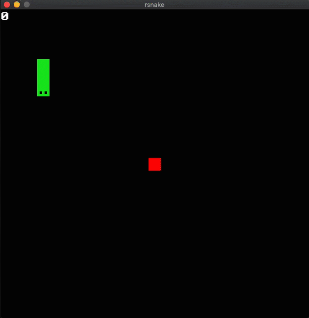

# rsnake - An implementation of classic snake in rust

This game was built using the [piston_window](https://github.com/PistonDevelopers/piston_window) window wrapper.



## Download the game
If youre using mac-osx or windows you can either download this game as executeable [here](https://github.com/schulke-214/rsnake/releases/tag/v1.0) - otherwise you can build it locally with `cargo`.

```bash
# run the game
cargo run

# build a binary & execute it
cargo build --release
./target/release/rsnake
```

## Keymap
- **W/A/S/D** or **Up/Left/Down/Right** - Controll snake direction.
- **R** - Restart the game.
- **ESC** - Quit the game.

## Known Flaws / ToDo List
- There should be an endscreen with restart / quit buttons.
- The fruit and snake could possibly spawn at the same coordinate / fruits can spawn inside the tail of the snake.